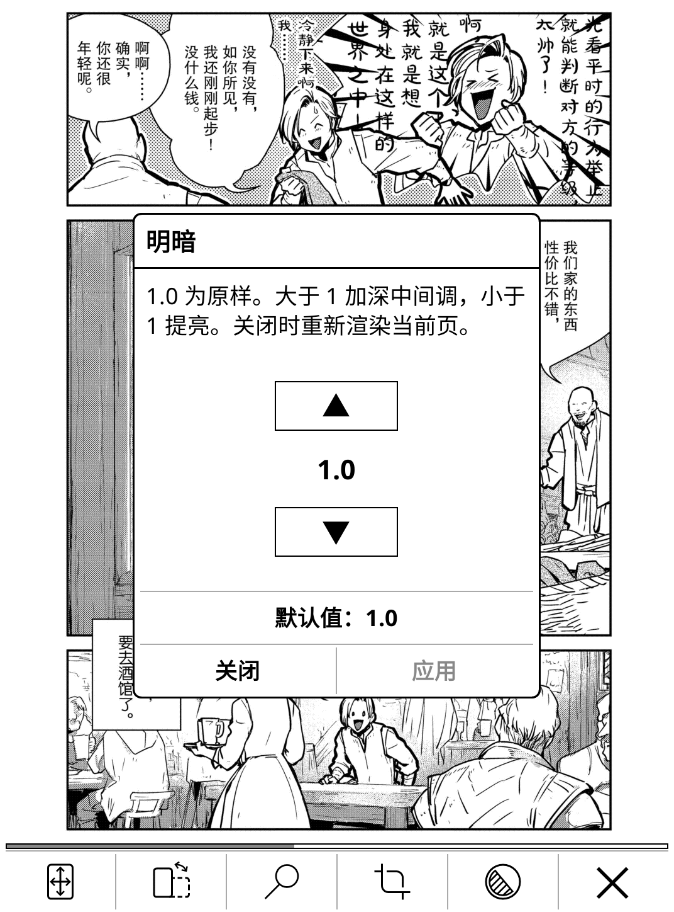

# opdsforcomic.koplugin

KOReader 的漫画 OPDS 客户端：在线看漫画，带页面预取、两级缓存、自动裁剪、双页与拆页。
An OPDS client for KOReader: read comics from a server, with page prefetching, two-level caching, auto crop, two-page and split modes.

**语言 / Language:** [中文](#中文) · [English](#english)

---

### 实机截图 · Screenshots

<table>
<tr>
<td width="50%"></td>
<td width="50%"></td>
</tr>
<tr>
<td width="50%"></td>
<td width="50%"></td>
</tr>
</table>

Kobo 墨水屏实机，点图看原图 · on a Kobo, tap an image for the full size.

---

## 中文

### 功能

从 OPDS 服务器（Suwayomi、Komga）直接看漫画，不用先下载到本地。派生自 KOReader 内置的 `opds.koplugin`，两者可同时启用。

- **翻页不看转圈**：提前抓取后续页；内存缓存 16 MB，可选磁盘缓存（默认关，上限 64 MB）。
- **图标工具栏**：底部一排图标按钮（适屏 / 旋转 / 跳页 / 裁剪 / 明暗 / 关闭），和 KOReader 自带阅读器一样。
- **明暗调节**：扫描发白或太暗时一键调整——0.5 ~ 0.9 提亮（步长 0.1）、**1.0 原样**、2 ~ 10 加深（步长 1.0）。JPEG / PNG / GIF / WebP / SVG 都支持。
- **自动去白边**（默认关）。
- **三种显示方式**：单页 / 双页 / 拆页。拆页把横着的跨页扫描按中线切成两页分别看；转横屏自动开双页。
- **文件夹快捷方式**：任意文件夹放一个 `.opdscomic` 空文件，点它直接进 OPDS。

### 安装

1. 从 [Releases](https://github.com/hugo1120/opdsforcomic.koplugin/releases) 下载 `opdsforcomic.koplugin.zip`，解压出 `opdsforcomic.koplugin` 文件夹。
2. 整个文件夹放进 KOReader 的 `plugins/`：Kobo `.adds/koreader/plugins/`，Kindle `koreader/plugins/`，Android `/sdcard/koreader/plugins/`，桌面 `~/.config/koreader/plugins/`。
3. 完全退出 KOReader 再启动。

> 从源码仓库下载的话，文件夹会叫 `opdsforcomic.koplugin-main`，要改名为 `opdsforcomic.koplugin`。

### 使用

**① 填服务器地址**：文件管理器 → 扳手图标 → 搜索标签 → `OPDS catalog (Comic)` → 左上角菜单 `Add catalog`：

| 服务器 | 地址 |
|---|---|
| **Suwayomi** | `http://主机:4567/api/opds/v1.2` |
| **Komga** | `http://主机:25600/opds/v1.2/catalog` |

- 结尾不能少写：Suwayomi 的 `/api/opds/v1.2`、Komga 的 `/opds/v1.2/catalog`，缺一段就 404。
- **Komga 用 v1.2，不要用 v2**：v2 下 KOReader 不支持页流，预取和逐页加载会退化成整本下载。
- 用户名密码：Komga 填你的 Komga 账号；Suwayomi 开了登录保护（`AUTH_MODE=basic_auth`）才需要填。

**② 建快捷方式**：在任意文件夹新建一个**空文件**，扩展名改成 `.opdscomic`（文件名随意），回到文件管理器**点它**就直接进 OPDS 界面。

**③ 阅读**：点屏幕**中间三分之一**唤出底部图标工具栏：适屏 / 旋转 / 跳页 / 裁剪 / 明暗 / 关闭。**长按「旋转」**打开显示面板（双页、拆页、从右到左、封面单屏）。「从右到左」默认开启，左开本漫画在面板里关掉。

**拆页**：有些资源把跨页存成一张横图，打开拆页后按中线切开，两页各占一屏；跳页和页码仍按服务器原始页号。已知短板：扫描时就转了 90° 的单页也是横的，会被切开，遇到只能关掉这个开关。

> 关闭阅读界面后，服务器上的进度可能「跳回」旧位置：缓存命中率高时真实请求很少，服务器没收到新进度，关闭时会补发一次。

### 服务端

本插件是客户端，需要你自己有一个 OPDS 服务器。以下两个都经过实机验证：

- **Suwayomi**（[github.com/Suwayomi/Suwayomi-Server](https://github.com/Suwayomi/Suwayomi-Server)）：桌面漫画服务器（Tachiyomi/Mihon 的重写），内置扩展商店，适合追连载。
- **Komga**（[komga.org](https://komga.org)）：媒体服务器，扫描你已有的漫画文件，元数据与阅读进度管理更细。

### 友情链接

- 🐧 [**LinuxDO**](https://linux.do) — 技术爱好者社区

### 许可

**AGPL-3.0**，全文见 [LICENSE](LICENSE)。派生自 KOReader 内置的 `opds.koplugin`（AGPL-3.0）。每个版本的改动见 [Release 说明](https://github.com/hugo1120/opdsforcomic.koplugin/releases)。

---

## English

### Features

Read comics straight from an OPDS server (Suwayomi, Komga) without downloading them first. A fork of KOReader's bundled `opds.koplugin`; both can be enabled at once.

- **No spinner between pages**: the next pages are fetched ahead of you — 16 MB in RAM, plus an optional disk cache (off by default, 64 MB).
- **Icon toolbar**: a bottom row of icons (Scale / Rotate / Go to / Crop / Tone / Close), same style as KOReader's own readers.
- **Tone**: fix washed-out or too-dark scans — 0.5 – 0.9 brightens (step 0.1), **1.0 untouched**, 2 – 10 darkens (step 1.0). JPEG / PNG / GIF / WebP / SVG.
- **Auto margin crop** (off by default).
- **Three display modes**: single / two pages / split — the split cuts a landscape spread scan back into two pages, and going landscape turns on two-page automatically.
- **Folder shortcut**: a `.opdscomic` empty file opens the catalog with one tap.

### Installation

1. Download `opdsforcomic.koplugin.zip` from [Releases](https://github.com/hugo1120/opdsforcomic.koplugin/releases) and unzip — you get an `opdsforcomic.koplugin` folder.
2. Move the whole folder into KOReader's `plugins/`: Kobo `.adds/koreader/plugins/`, Kindle `koreader/plugins/`, Android `/sdcard/koreader/plugins/`, desktop `~/.config/koreader/plugins/`.
3. Quit KOReader completely and start it again.

> If downloaded from the source repository, the folder unpacks as `opdsforcomic.koplugin-main` and must be renamed to `opdsforcomic.koplugin`.

### Usage

**① Enter a server**: File manager → wrench icon → Search tab → `OPDS catalog (Comic)` → top-left menu `Add catalog`:

| Server | Address |
|---|---|
| **Suwayomi** | `http://host:4567/api/opds/v1.2` |
| **Komga** | `http://host:25600/opds/v1.2/catalog` |

- Keep the full path — Suwayomi's `/api/opds/v1.2` and Komga's `/opds/v1.2/catalog` return 404 if shortened.
- **On Komga use v1.2, not v2**: KOReader does not support page streaming over v2, which breaks prefetching and per-page loading.
- Credentials: Komga wants your Komga account; Suwayomi only when login protection is on (`AUTH_MODE=basic_auth`).

**② Make a shortcut**: create an **empty file** with a `.opdscomic` extension (any name) in any folder; back in the file manager, **tap it** to open the catalog.

**③ Read**: tap the **middle third** of the screen for the bottom icon toolbar: Scale / Rotate / Go to / Crop / Tone / Close. **Long press Rotate** for the display panel (two pages, split, right to left, cover first). "Right to left" is on by default; turn it off for left-bound books.

**Split**: releases that store a spread as one landscape image are cut at the middle, so each page gets its own screen. `Go to` and the page counter keep the server's original page numbers. Known gap: a single page stored a quarter-turn rotated is also landscape and will be cut — turn the switch off for those.

> After closing the reader the server's position may appear to jump back: with a high cache hit rate few real requests reach the server, so the position is reported once on close.

### Server side

This plugin is the client; you need an OPDS server of your own. Both below are tested:

- **Suwayomi** ([github.com/Suwayomi/Suwayomi-Server](https://github.com/Suwayomi/Suwayomi-Server)): desktop manga server (a rewrite of Tachiyomi/Mihon) with a built-in extension store, for following ongoing series.
- **Komga** ([komga.org](https://komga.org)): a media server for comics you already have, with finer metadata and progress control.

### Friend links

- 🐧 [**LinuxDO**](https://linux.do) — A community for tech enthusiasts

### License

**AGPL-3.0**, full text in [LICENSE](LICENSE). Derives from KOReader's bundled `opds.koplugin`, which is AGPL-3.0. Each release's [notes](https://github.com/hugo1120/opdsforcomic.koplugin/releases) list what changed.
