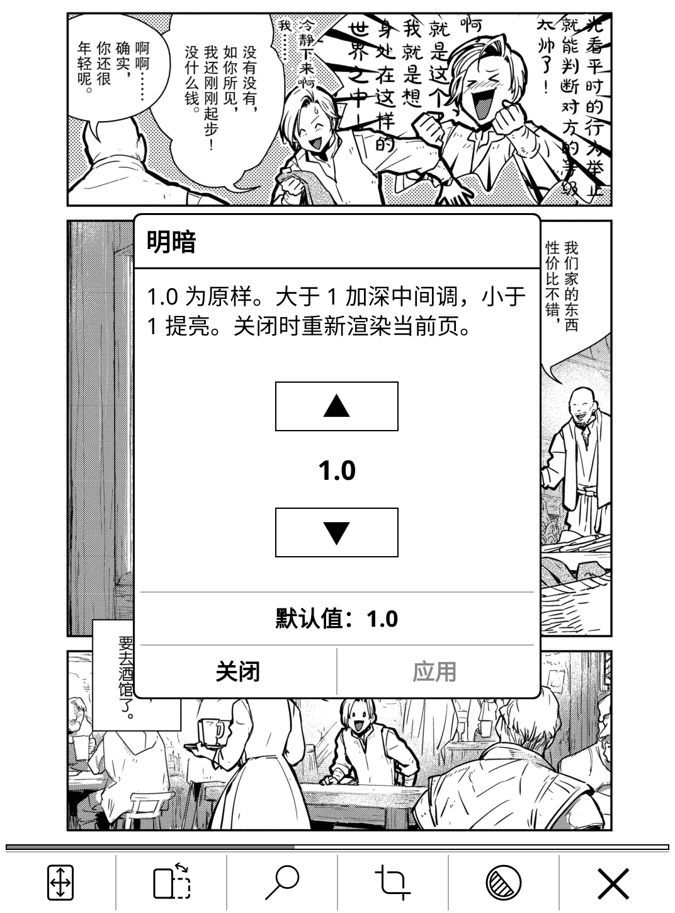
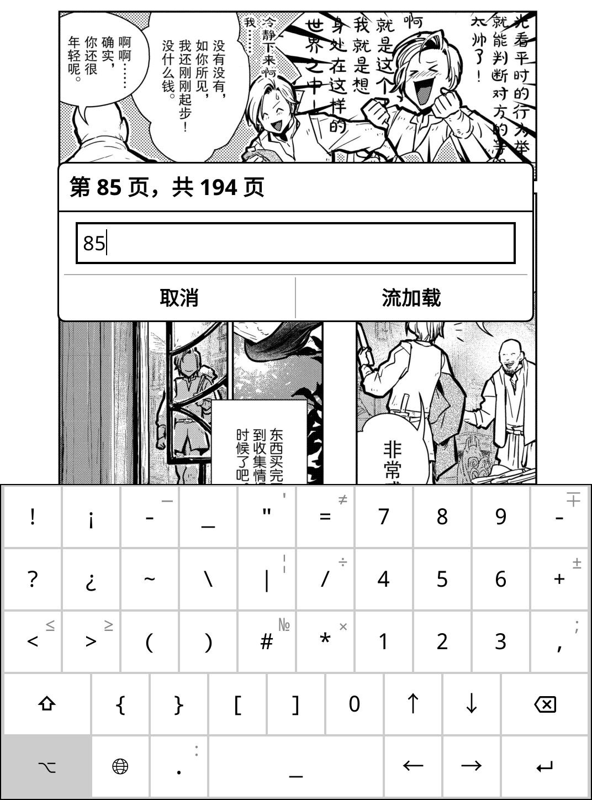

# opdsforcomic.koplugin

KOReader 的漫画 OPDS 客户端：在线看漫画，带页面预取、两级缓存、自动裁剪、双页与拆页。
An OPDS client for KOReader: read comics from a server, with page prefetching, two-level caching, auto crop, two-page and split modes.

**语言 / Language:** [中文](#中文) · [English](#english)

**当前版本 / Current version: [0.1.6](https://github.com/hugo1120/opdsforcomic.koplugin/releases/tag/0.1.6)**（2026-10-08）

---

### 实机截图 · Screenshots

<table>
<tr>
<td width="50%"></td>
<td width="50%"></td>
</tr>
<tr>
<td width="50%"></td>
<td width="50%"></td>
</tr>
</table>

Kobo 墨水屏实机，点图看原图 · on a Kobo, tap an image for the full size.

---

## 中文

更新记录见 [0.1.6 Release](https://github.com/hugo1120/opdsforcomic.koplugin/releases/tag/0.1.6)。

### 功能

从 OPDS 服务器（Suwayomi、Komga）直接看漫画，不用先下载到本地。派生自 KOReader 内置的 `opds.koplugin`，两者可同时启用。

- **页面预取与缓存**：提前抓取后续页；压缩数据内存缓存目标 8 MiB（至少保留两页），解码后的整页、半页缓存单张最多 8 MiB、合计最多 16 MiB；可选磁盘缓存默认关闭，上限 64 MiB。缓存预算不代表进程内存峰值。
- **超大图低内存解码**：黑白屏（如 512 MB 的 Kobo）上超过约 800 万像素的 PNG/JPEG 走低内存路线——PNG 直接解成灰度再原生缩小，JPEG 在解码时缩小，保留约 800 万像素的灰度阅读副本。适屏阅读清晰度保持正常，高倍率放大的细节会少于原图；彩色屏与普通尺寸图片不变。
- **图标工具栏**：底部一排图标按钮（适屏 / 旋转 / 跳页 / 裁剪 / 明暗 / 关闭），和 KOReader 自带阅读器一样。
- **明暗调节**：扫描发白或太暗时一键调整——0.5 ~ 0.9 提亮（步长 0.1）、**1.0 原样**、2 ~ 10 加深（步长 1.0）。JPEG / PNG / GIF / WebP / SVG 都支持。
- **前光面板**：长按工具栏的「明暗」打开设备前光——亮度、暖光（设备支持时），带可调色温 LED 的机型还多一项色温配置。面板是 KOReader 自己的，各项按机型能力显示；没有前光的设备上这个长按不生效。
- **自动去白边**（默认关）。
- **三种显示方式**：单页 / 双页 / 拆页。拆页把横着的跨页扫描按中线切成两页分别看；转横屏自动开双页。
- **文件夹快捷方式**：任意文件夹放一个 `.opdscomic` 空文件，点它直接进 OPDS。
- **Suwayomi 章节直读**：点章节名直接进阅读器，省掉中间的元数据页和下载对话框——每章少两次点击。
- **章节导航**：读到章末再往后翻，直接问你要不要开下一章，**章节名一并列出**；底部工具栏长按「跳页」看前后各 5 章。
- **实体翻页键**：支持设备自身的翻页键；配合下面的遥控项目，还可以用手机遥控翻页、旋转和全刷。
- **直接续读**：打开章节时优先加载记录的源页；拆页按源图保存进度，不保证恢复到同一半页。

### 配套：手机遥控翻页

[**koreader_remote_turnpages**](https://github.com/hugo1120/koreader_remote_turnpages) —— 用手机当 KOReader 的遥控器：

- **翻页**：上一页 / 下一页
- **旋转**：横竖屏切换（左手倒持看漫画时很顺手）
- **全刷**：手动消残影。墨水屏攒久了会有鬼影，这是唯一能一键清掉的办法

插件这边不用额外设置；装上遥控端、在同一局域网里连上就行。没有遥控器也不影响任何功能，实体翻页键照常可用。

### 安装

1. 从 [0.1.6 Release](https://github.com/hugo1120/opdsforcomic.koplugin/releases/tag/0.1.6) 下载 `opdsforcomic.koplugin.zip`，解压出 `opdsforcomic.koplugin` 文件夹。
2. 整个文件夹放进 KOReader 的 `plugins/`：Kobo `.adds/koreader/plugins/`，Kindle `koreader/plugins/`，Android `/sdcard/koreader/plugins/`，桌面 `~/.config/koreader/plugins/`。
3. 完全退出 KOReader 再启动。

> 也可下载[当前源码 ZIP](https://github.com/hugo1120/opdsforcomic.koplugin/archive/refs/heads/main.zip)，解压后将 `opdsforcomic.koplugin-main` 改名为 `opdsforcomic.koplugin`。

### 使用

**① 填服务器地址**：文件管理器 → 扳手图标 → 搜索标签 → `OPDS catalog (Comic)` → 左上角菜单 `Add catalog`：

| 服务器 | 地址 |
|---|---|
| **Suwayomi** | `http://主机:4567/api/opds/v1.2` |
| **Komga** | `http://主机:25600/opds/v1.2/catalog` |

- 结尾不能少写：Suwayomi 的 `/api/opds/v1.2`、Komga 的 `/opds/v1.2/catalog`，缺一段就 404。
- **Komga 用 v1.2，不要用 v2**：v2 下 KOReader 不支持页流，预取和逐页加载会退化成整本下载。
- 用户名密码：Komga 填你的 Komga 账号；Suwayomi 开了登录保护（`AUTH_MODE=basic_auth`）才需要填。

**② 建快捷方式**：在任意文件夹新建一个**空文件**，扩展名改成 `.opdscomic`（文件名随意），回到文件管理器**点它**就直接进 OPDS 界面。

**③ 阅读**：点屏幕**中间三分之一**唤出底部图标工具栏：适屏 / 旋转 / 跳页 / 裁剪 / 明暗 / 关闭。**长按「旋转」**打开显示面板（双页、拆页、从右到左、封面单屏）；**长按「跳页」**打开章节导航（前后各 5 章，当前章标「正在阅读」）；**长按「明暗」**打开设备前光面板（亮度、暖光，有的话）。「从右到左」默认开启，左开本漫画在面板里关掉。

**拆页**：有些资源把跨页存成一张横图，打开拆页后按中线切开，两页各占一屏。跳页面板与服务端进度使用原始源页号，底部进度条按实际显示屏数计算。拆页开关会保留到其他章节，识别为单页的源图仍完整显示一屏。已知短板：扫描时就转了 90° 的单页也可能被当成双页切开，遇到请关闭拆页。

> 关闭阅读界面时，插件按最后成功显示的源页补报进度；本次未前进时不额外上报。双页记录画面中后一张源页，拆页记录源图编号。补报用于让缓存命中时的阅读进度也能同步到服务器。

### 服务端

本插件是客户端，需要你自己有一个 OPDS 服务器。以下两个都经过实机验证：

- **Suwayomi**（[github.com/Suwayomi/Suwayomi-Server](https://github.com/Suwayomi/Suwayomi-Server)）：桌面漫画服务器（Tachiyomi/Mihon 的重写），内置扩展商店，适合追连载。
- **Komga**（[komga.org](https://komga.org)）：媒体服务器，扫描你已有的漫画文件，元数据与阅读进度管理更细。

### 友情链接

- 🐧 [**LinuxDO**](https://linux.do) — 技术爱好者社区

### 许可

**AGPL-3.0**，全文见 [LICENSE](LICENSE)。派生自 KOReader 内置的 `opds.koplugin`（AGPL-3.0）。每个版本的改动见 [Release 说明](https://github.com/hugo1120/opdsforcomic.koplugin/releases)。

---

## English

See the [0.1.6 Release](https://github.com/hugo1120/opdsforcomic.koplugin/releases/tag/0.1.6) for the changelog.

### Features

Read comics straight from an OPDS server (Suwayomi, Komga) without downloading them first. A fork of KOReader's bundled `opds.koplugin`; both can be enabled at once.

- **Page prefetching and caching**: compressed data targets an 8 MiB RAM budget, keeping at least two pages; decoded whole pages and halves retain up to 8 MiB each and 16 MiB in total. An optional disk cache is off by default and capped at 64 MiB. These budgets do not cap peak process memory.
- **Low-memory decoding for oversized images**: on a monochrome screen (a 512 MB Kobo, say), PNG/JPEG above roughly 8 megapixels take a low-memory path — PNG decodes straight to grayscale and is then scaled natively, JPEG is scaled while decoding, keeping a ~8-megapixel grayscale reading copy. Fit-to-screen sharpness is unchanged; zooming in shows less detail than the original. Colour screens and ordinary sizes are unaffected.
- **Icon toolbar**: a bottom row of icons (Scale / Rotate / Go to / Crop / Tone / Close), same style as KOReader's own readers.
- **Tone**: fix washed-out or too-dark scans — 0.5 – 0.9 brightens (step 0.1), **1.0 untouched**, 2 – 10 darkens (step 1.0). JPEG / PNG / GIF / WebP / SVG.
- **Frontlight panel**: long press `Tone` in the toolbar for the device's frontlight — brightness, warmth where the device has it, and a colour configuration on boards with adjustable-temperature LEDs. It is KOReader's own panel, so it shows only what the device actually reports; on a reader with no frontlight the long press does nothing.
- **Auto margin crop** (off by default).
- **Three display modes**: single / two pages / split — the split cuts a landscape spread scan back into two pages, and going landscape turns on two-page automatically.
- **Folder shortcut**: a `.opdscomic` empty file opens the catalog with one tap.
- **Suwayomi chapters open straight into the reader**: tapping a chapter skips the metadata page and the download dialog — two taps fewer per chapter.
- **Chapter navigation**: turning past a chapter's last page offers to carry on, **naming the chapter**; long press `Go to` in the toolbar for five chapters either way.
- **Hardware page keys**, plus phone remote control of page turns, rotation and full refresh via the project below.
- **Direct resume**: load the recorded source page first. Split mode saves progress by source image and may reopen on a different half of that image.

### Companion: phone remote control

[**koreader_remote_turnpages**](https://github.com/hugo1120/koreader_remote_turnpages) turns a phone into a KOReader remote:

- **Page turns** — previous / next
- **Rotate** — portrait / landscape, handy when holding the reader upside down
- **Full refresh** — clears e-ink ghosting on demand; this is the only one-tap way to do it

Nothing to configure on the plugin side: install the remote app and put both on the same network. The plugin works fine without it, and the device's own page keys keep working.

### Installation

1. Download `opdsforcomic.koplugin.zip` from the [0.1.6 Release](https://github.com/hugo1120/opdsforcomic.koplugin/releases/tag/0.1.6) and unzip it to get the `opdsforcomic.koplugin` folder.
2. Move the whole folder into KOReader's `plugins/`: Kobo `.adds/koreader/plugins/`, Kindle `koreader/plugins/`, Android `/sdcard/koreader/plugins/`, desktop `~/.config/koreader/plugins/`.
3. Quit KOReader completely and start it again.

> Alternatively, download the [current source ZIP](https://github.com/hugo1120/opdsforcomic.koplugin/archive/refs/heads/main.zip) and rename the extracted `opdsforcomic.koplugin-main` folder to `opdsforcomic.koplugin`.

### Usage

**① Enter a server**: File manager → wrench icon → Search tab → `OPDS catalog (Comic)` → top-left menu `Add catalog`:

| Server | Address |
|---|---|
| **Suwayomi** | `http://host:4567/api/opds/v1.2` |
| **Komga** | `http://host:25600/opds/v1.2/catalog` |

- Keep the full path — Suwayomi's `/api/opds/v1.2` and Komga's `/opds/v1.2/catalog` return 404 if shortened.
- **On Komga use v1.2, not v2**: KOReader does not support page streaming over v2, which breaks prefetching and per-page loading.
- Credentials: Komga wants your Komga account; Suwayomi only when login protection is on (`AUTH_MODE=basic_auth`).

**② Make a shortcut**: create an **empty file** with a `.opdscomic` extension (any name) in any folder; back in the file manager, **tap it** to open the catalog.

**③ Read**: tap the **middle third** of the screen for the bottom icon toolbar: Scale / Rotate / Go to / Crop / Tone / Close. **Long press Rotate** for the display panel (two pages, split, right to left, cover first); **long press the `Go to` icon** for the chapter navigator — five chapters either way, with the current one marked; **long press `Tone`** for the device's frontlight panel (brightness, warmth where available). "Right to left" is on by default; turn it off for left-bound books.

**Split**: a spread stored as one landscape image is cut at the middle, so each half gets its own screen. `Go to` and server progress use original source page numbers; the bottom progress bar counts display screens. The split setting persists across chapters, and images identified as single pages remain one whole screen. Known gap: a single page stored a quarter-turn rotated may also be identified as a spread; turn the switch off for those.

> Closing the reader reports the last successfully displayed source page if you advanced during the session. Two-page mode reports the latter source page in the view; split mode reports the source image number. This also synchronizes progress when page turns use cached images.

### Server side

This plugin is the client; you need an OPDS server of your own. Both below are tested:

- **Suwayomi** ([github.com/Suwayomi/Suwayomi-Server](https://github.com/Suwayomi/Suwayomi-Server)): desktop manga server (a rewrite of Tachiyomi/Mihon) with a built-in extension store, for following ongoing series.
- **Komga** ([komga.org](https://komga.org)): a media server for comics you already have, with finer metadata and progress control.

### Friend links

- 🐧 [**LinuxDO**](https://linux.do) — A community for tech enthusiasts

### License

**AGPL-3.0**, full text in [LICENSE](LICENSE). Derives from KOReader's bundled `opds.koplugin`, which is AGPL-3.0. Each release's [notes](https://github.com/hugo1120/opdsforcomic.koplugin/releases) list what changed.
